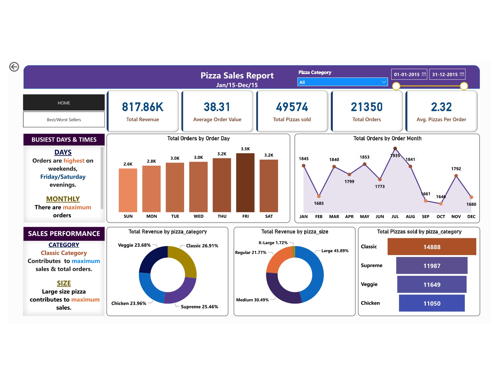
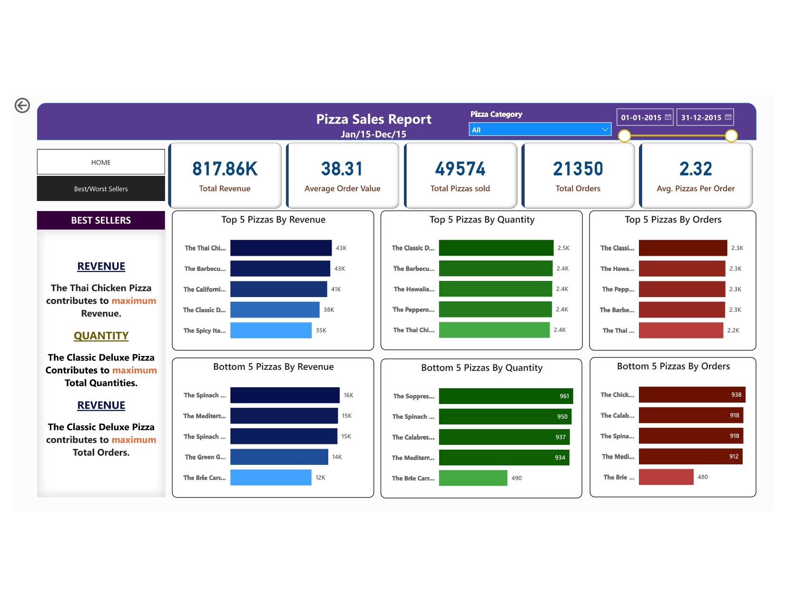

# Sales Navigator: Navigating Trends & Behaviors with Power BI Analytics

## January, 2024

**Project Overview:**

In January 2024, I spearheaded the development of a comprehensive sales analytics dashboard using Power BI. The project aimed to provide insights into sales trends, customer behavior, and performance metrics, enabling stakeholders to make data-driven decisions and optimize sales strategies.

**Project Objectives:**

1. **Develop Sales Analytics Dashboard:** The primary objective was to create a user-friendly and interactive dashboard that consolidates sales data from various sources and provides actionable insights into sales performance.

2. **Data Cleaning and Transformation:** Leveraging Power Query, the project involved cleaning, transforming, and filtering raw sales data from multiple sources. This process ensured data accuracy and reliability, laying the foundation for meaningful analysis.

3. **Statistical Analysis:** Utilizing Microsoft SQL Server, key performance indicators (KPIs) and calculated measures were created to analyze sales trends, customer behavior, and performance metrics. Statistical analysis techniques were employed to uncover patterns and trends within the data.

4. **Data Visualization:** Demonstrating proficiency in data visualization principles, the project focused on creating interactive and visually appealing dashboards using Power BI. These dashboards provided stakeholders with intuitive insights into sales performance and actionable recommendations for improvement.

**Development Process:**

### Data Collection and Preparation:

The first step involved gathering sales data from various sources, including CRM systems, transaction databases, and marketing platforms. This raw data was then cleaned, transformed, and filtered using Power Query to ensure consistency and accuracy.

### Statistical Analysis and Modeling:

With the clean dataset, statistical analysis and modeling techniques were applied to identify trends and patterns within the sales data. Key performance indicators (KPIs) such as sales growth rates, customer acquisition costs, and customer lifetime value were calculated to assess overall sales performance.

Advanced statistical techniques such as regression analysis and time series forecasting were also employed to predict future sales trends and anticipate market fluctuations.

### Data Visualization with Power BI:

The culmination of the project was the creation of interactive and user-friendly dashboards using Power BI. These dashboards featured dynamic visualizations such as line charts, bar graphs, and heatmaps, allowing stakeholders to explore sales data and uncover insights with ease.

Interactive elements such as slicers, filters, and drill-down capabilities enabled users to analyze sales performance at different levels of granularity and gain deeper insights into customer behavior and market trends.

### Dashboard:

#### Slide 1: Key Performance Indicators (KPIs)

The first slide of the Power BI dashboard provides an overview of key performance indicators (KPIs) such as total sales revenue, sales growth rate, customer acquisition cost, and customer satisfaction score. These KPIs offer stakeholders a high-level view of sales performance and help identify areas that require further analysis and improvement.

#### Slide 2: Top and Bottom Comparison

The second slide of the Power BI dashboard offers a top and bottom comparison of sales performance, highlighting the best-performing and worst-performing products, sales regions, or sales representatives. This comparison enables stakeholders to identify successful strategies and areas for optimization, driving more targeted and effective sales initiatives.

**Key Features:**

1. **Comprehensive Dashboard:** The Power BI dashboard provided a comprehensive overview of sales performance, customer behavior, and key performance metrics. Interactive features allowed stakeholders to customize their analysis and focus on the most relevant aspects of the data.

2. **Data Accuracy and Reliability:** Leveraging Power Query and Microsoft SQL Server, the project ensured that the sales data used for analysis was clean, accurate, and reliable. This laid the foundation for meaningful insights and informed decision-making.

3. **Predictive Analytics:** By applying advanced statistical techniques, the project enabled stakeholders to predict future sales trends and anticipate market fluctuations. This proactive approach empowered stakeholders to make data-driven decisions and adapt their sales strategies accordingly.

**Conclusion:**

The "Sales Navigator" project represented a significant achievement in leveraging data analytics to drive sales effectiveness and optimize business performance. By harnessing the power of Power BI, SQL, and statistical analysis techniques, the project provided stakeholders with actionable insights into sales trends, customer behavior, and performance metrics, enabling them to make informed decisions and drive business growth.

Moving forward, continued investment in data analytics capabilities and a data-driven approach to sales management will be essential for organizations to stay competitive in today's dynamic marketplace.
